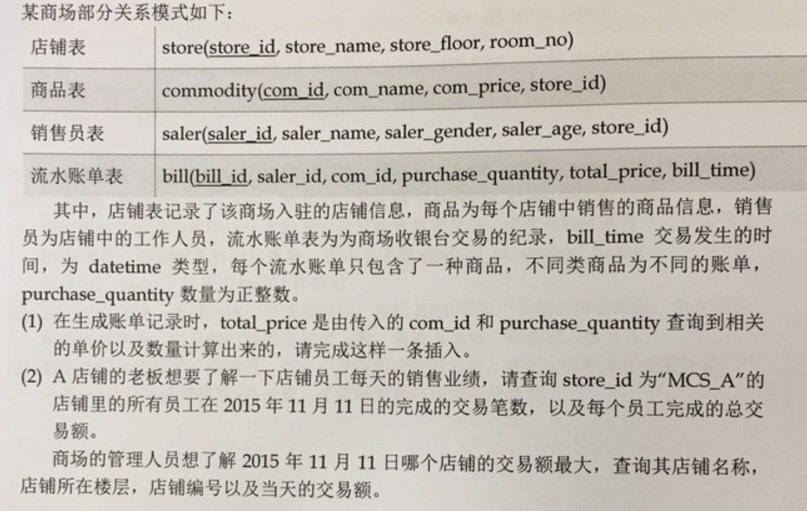
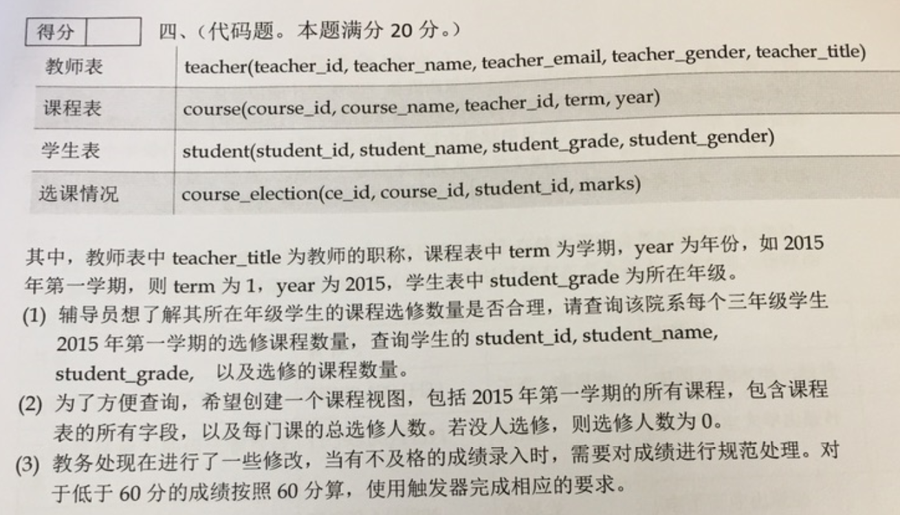
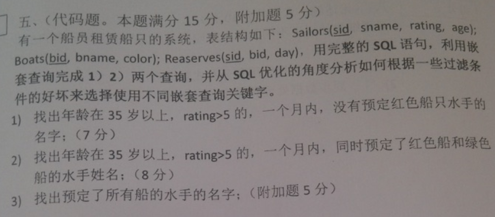

Exam0-历年试卷
---

# 1. 选择题
1. 【2020】考试选择题来自平时教学立方的选择题

# 2. 简答题
1. 试简要描述DBMS中SQL语句的执行过程，并简单对各个步骤锁花费的代价大小进行描述和比较
   1. 语法分析：
      1. 分析语句的语法是否符合规范
      2. 衡量语句中各表达式的意义
      3. 分析语句的语法是否符合规范，代价小
   2. 语义分析
      1. 检查语句中涉及的所有数据库对象是否存在
      2. 检查用户有相应的权限
      3. 代价小
   3. 视图转换：将设计视图的查询语句转换为相应的对基表查询语句
   4. 表达式转换：将复杂的SQL表达式转换为较简单的等效连接表达
   5. 选择优化器：不同的优化器一般产生不同的“执行计划”
   6. 选择连接方式表：Oracle有三种连接范式，对多表连接Oracle可选择适当的链接方式
   7. 选择连接顺序：对多表连接Oracle可选择适当的连接方式，
   8. 选择数据的搜索路径：根据以上条件选择合适的数据搜索路径，如是选用全表搜索还是利用索引或是其他方式。
   9. 运行“执行计划”
2. 请解释硬解析和软解析的含义和区别
   1. 分为硬解析和软解析。
      1. 硬解析指使用优化器对SQL进行优化，将SQL转化为一些等价语句，并选择代价最小的语句生成执行计划。
      2. 软解析是指共享池中已经存在有对应的执行计划，则不再进行优化，直接使用该执行计划。
      3. 硬解析代价最大，软解析代价较小。
   2. 若在共享池中没有找到已有的执行计划则进行硬解析，否则进行软解析。
   3. 运行执行计划，返回执行结构。运行执行计划的代价根据SQL语句的不同可大可小。
3. 将类似的SQL由硬解析编程软解析的技术称为什么？
4. 对上述技术进行举例描述？
5. 【2020】生成简单预测的SQL语句
6. 【2020】完成3个SQL语句的编写，并从优化角度做出说明，分析如何根据一些过滤条件的好坏来选择不同嵌套查询关键字。
7. 【2020】考前复习：一个运行一段时间的大型数据库系统中有一条SQL语句变慢了，查询特别耗时间，猜测什么原因，你该怎么做？
8. DBMS中索引有很多种，请简述下列问题：
   1. 位图索引(bitmap index)的存储结构和用途
   2. 函数索引(function-based index)的含义和用途
   3. 反向键索引或逆向索引(inverse index)的含义和用途
   4. 你还知道什么索引类型，并简单描述？额外最多加5分
   5. 什么是索引？
   6. 哈希索引的结构、适用范围是什么？如何避免哈希冲突？
9. B+ Tree索引是大多数DBMS缺省的索引类型，请详细描述一下几个问题
   1. B树索引的结构和使用方式
   2. 何时使用B树索引，并分别说明原因；并详细说明为什么系统的为外键构建索引是普遍的要求
   3. 针对2有没有例外情况？如果有请简要说明理由
   4.  请描述Oracle中一种类似于B树索引结构的物理组织形式索引组织表(IOT)的基本结构和应用范围。
10. 请举例描述邻接模型和物化路径模型将树状结构存储到关系表结构的设计方法，并通过不同的查询(包括自顶向下的查询、自底向上的查询、集合查询)来比较不同表结构设计下SQL的效率。
11. 请详细描述关于数据库范式和逆范式(或称为反范式)的以下几个问题
    1. 什么是逆范式？
    2. 你认为判断何时该使用逆范式的条件有哪些？
    3. 对于2，针对每一种条件的下的情况，请简单的举一些例子说明。
12. 为什么说关系数据库比层状/网状数据库更“科学”？
13. 关系理论认为，数据中不应该有重复数据，记录之间也不存在顺序关系。在现实的关系型数据库中又是如何处理的？
14. 关系理论中的空值和实际关系数据库中控制的处理有何差异？
15. 魔药设计：假设药品的组成为
    1. 药品A(成本 A 20%，成本 B 20%，药品 B 60%)
    2. 药品B(成本 C 30%，成本 D 30%，成本 B 40%)
    3. 请设计表结构，并写出如何查询药品A的具体组成成分及其百分比
16. 高并发下的为了确保性能，锁的解决方案是什么样的？解决资源竞争有哪些方法？
17. 简述查询优化器的工作原理和局限性
18. 绑定变量有什么好处？
19. 关系数据库、数据仓库、NoSQL的发展演化和内在联系是什么样的？

# 3. 代码题

## 3.1. 代码题三

## 3.2. 代码题四

## 3.3. 代码题五

## 3.4. 代码题六

