Lec3-索引结构及使用
---

# 1. B树索引的结构和应用

## 1.1. B树(B+树)的结构
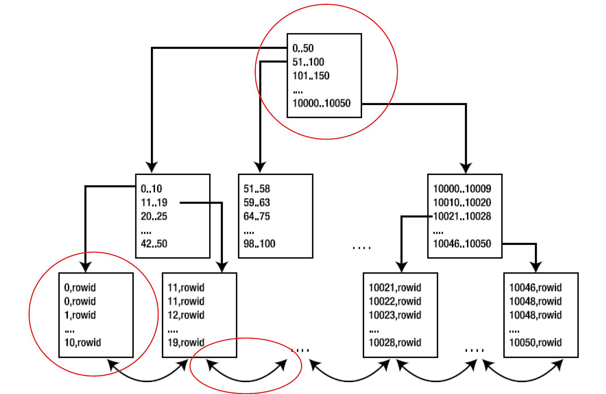

1. B树是一块一块的将数据读取到内存，哪怕访问的是一条，也会把该条所在的块读入到内存。
2. 为什么最开始的时候是4k一块？因为磁盘盘面转一圈是4k的存大小(1次IO操作)
3. 为什么底下是连接的？因为整个底层是一个顺序文件(连接的)
4. B树结构的深度？

## 1.2. B+树索引做什么？
1. 充分理解B+树索引的结构，你就能充分B+树能做什么不能做什么？
2. 能做的
   1. 全键值 Where x = 123
   2. 键值范围 Where 45 < x < 123
   3. 键前缀查找 where x LIKE J%'
3. 根据结构，请思考B+树索引不能做的有哪些?但是未必能提高
   1. 等值查询：3次索引IO和1次基本表IO
   2. 范围查询(1 - 100，含)：批量插入的时候索引的顺序和块的顺序是一致的，但是往往不一定会进行批量插入的(堆文件随机插入)。

## 1.3. 索引的另一面（问题）
1. 索引并不是因为提高磁盘查询效率而产生的数据
2. 数据库是可以使用硬件等方式来弥补不足。
3. 磁盘空间的开销

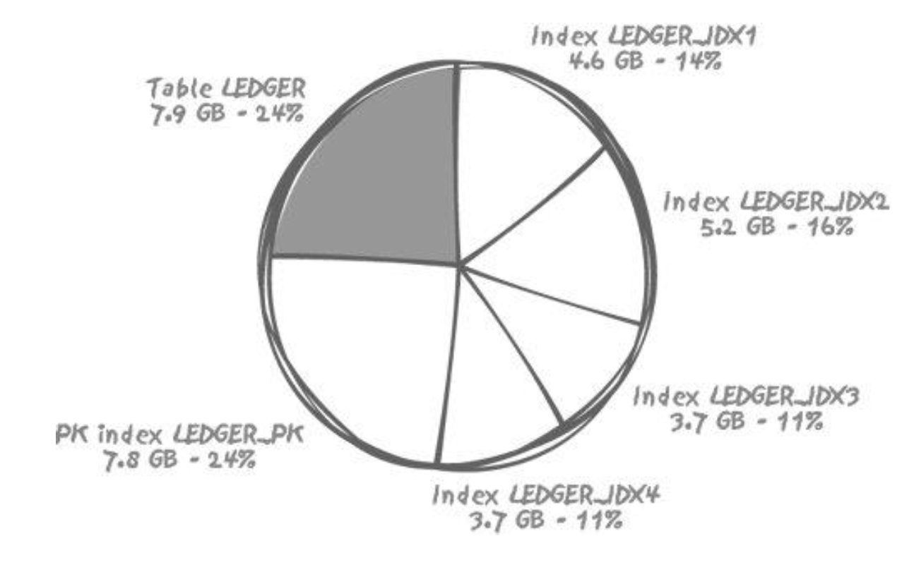

1. 磁盘空间的开销、处理Oracle：以创建表为例子，做查询的衰减情况如下：索引是竞争的重点。
2. 有触发器的数据库被称为主动数据库。

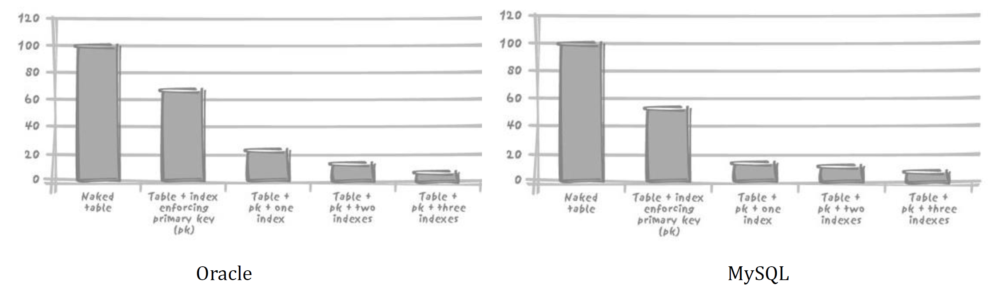

3. 数据库系统处理的开销

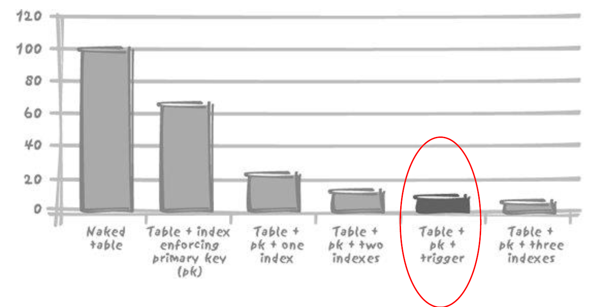

4. 那么不管怎么样，但，它至少能够提升查询效率不是吗?
5. 思考题
   1. 对于B+树索引，不少数据库都有自己的处理方式，比如，MySQL中不同的存储引擎使用了不同的方式把索引保存到磁盘上，他们会影响性能。
      1. MyISAM使用前缀压缩以减少索引，而InnoDB不会压缩索引，(有啥差别? )
      2. MyISAM索引按照行存储的物理位置引用被索引的行，但是InnDB按照主键值引用行，(有啥差别?)
   2. 请有兴趣的同学尝试去看一下你所用数据库索引的官方参考
   3. 欢迎你的思考和留言

## 1.4. 让索引发挥作用
1. 索引有可能降低查询效率嘛?
   1. 有可能
2. 索引和目录
   1. 索引和目录是两种完全不同的机制
   2. 索引是一种以原子粒度访问数据库的手段而不是为了检索大量数据的
3. 索引的使用是否合理，首先取决于它是否有用.
4. 判断索引适用性的依据是检索比例(retrieval ratios)
5. 什么时候应该使用B树索引
   1. 仅需要通过索引访问基本表的很少一部分行
   2. **如果要处理表中的多行，可以使用索引而不使用表**
6. 关系型数据库并发写困难

## 1.6. 只使用索引，不使用表
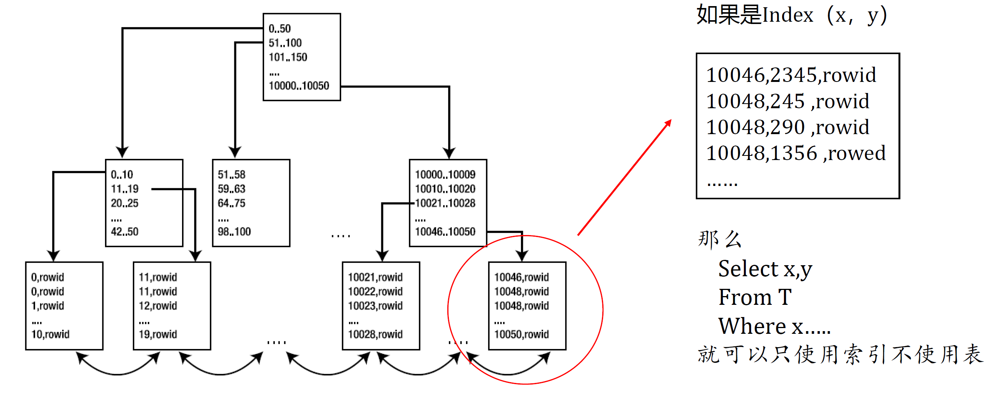

1. 复合键索引，本质上索引是按照排名第一的字段进行的索引

## 1.7. 让索引发挥作用
1. 索引只是查询工作的第一步
2. 读取基本表中的数据才是查询的结束
3. 同样的索引，但不同的物理结构，可能会引起查询效率的千差万别
   1. 磁盘访问的速率
   2. 物理I/O很可能是内存访问
   3. 记录存储


## 1.8. 索引无论怎么样，都是数据库的重要组成部分
1. 索引始终是数据库中极重要的组成部分
   1. 通用目的或事务处理型数据库系统
   2. 决策支持系统
2. 事务处理型数据库中"太多索引 $\approx$ 设计不够稳定”

## 1.9. 思考题
1. 既然，使用复合键索引，在select子句中，如果所有字段都在复合键索引所包括的字段之中的时候，查询可以只使用索引不使用表
2. 那么,为什么不可以针对表T (x,y;z) 这样的表，直接构建一 个索引index (x,y,z) ，这样所有对这个表的访问就可以直接使用索引不使用表了，这会不会大幅度地提升查询效率呢?

# 2. 其他索引结构
1. 哈希索引(Hash Index)：MySQL
2. 位图索引(Bitmap Index)：Oracle
3. 位图联结索引(Bitmap join index):Oracle
4. 函数索引(function-based index)

## 2.1. 哈希索引
1. 哈希索引结构

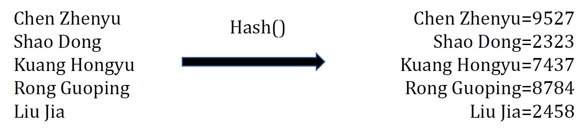

2. 根据结构，你能告诉我哈希索引做什么不能做什么？碰撞率的问题：一般是使用10倍的范围

## 2.2. 位图索引
1. Bitmap index, Oracle7.3引入, 位数据库仓库查询环境设计
2. 位图索引的结构
   1. 每次交换都会将对应的1/0进行交换，每次锁住的是全部索引。
   2. 低选择字段不要修改或尽可能小的修改。
   3. 新的feature一定要看完。

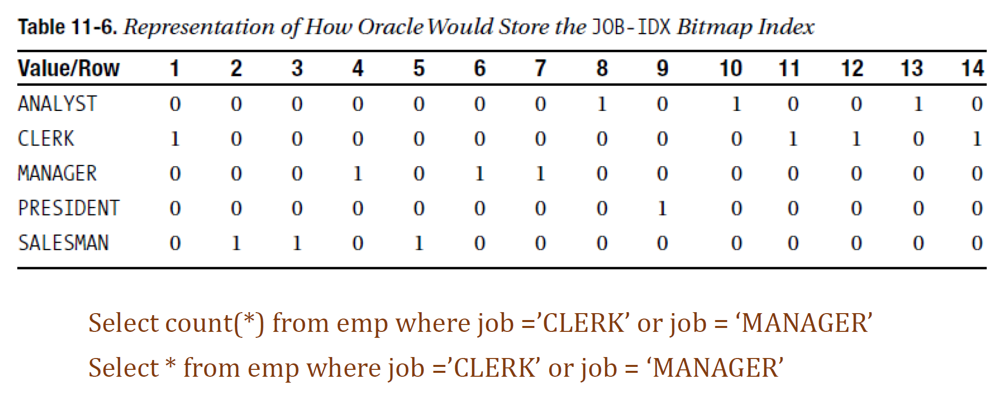

### 2.2.1. 什么是位图索引
1. 相异基数(distinct cardinality)低
2. 大量临时查询的聚合

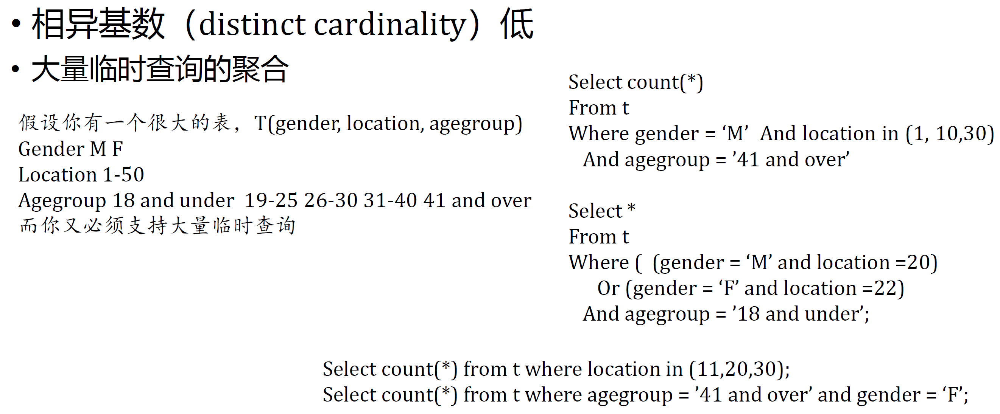

## 2.3. 位图联结索引(Bitmap join index)
1. 允许使用另外某个表的列对一个给定表建立索引。实际上，这就是允许对一个索引结构(而不是表本身)中的数据进行逆规范化。

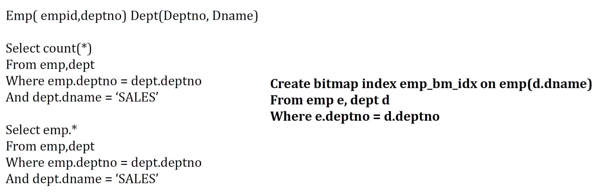

## 2.4. MySQL怎么办？
1. MySQL没有位图索引
   1. 优化替代索引组合
   2. 低选择性添加特殊索引
2. Select * from profiles where sex = 'M' order by rating limit 10;可以添加sex，rating列上的复合索引。
3. select * from profiles where sex = 'M' order by rating limit 100000, 10;
   1. 依旧很慢，更好的策略是限制用户**查看的页数**
   2. 也可以

```sql
Select * from t inner join (
  Select id from t
    Where x.sex ='m' order by rating limit 100000, 10
  )AS x USING id;
```

## 2.5. 函数索引
1. 函数索引，对F(x)的值构建索引，在通过对索引读取x所指向的记录行
   1. X索引，和F(x)的索引完全不一样
2. 想一想，函数索引|能用在哪?
   1. 不区分大小写的查询：
      1. `Creat index emp_upper_idx on emp(upper(ename))`
      2. `Select * from emp where upper(name) = 'KING'`
   2. T、F的巨大差异下的索引
   3. 有选择的唯一性
      1. `Create unique index active_project_must_be_unique on projects(case when status = 'ACTIVE' then name end)`

## 2.6. 还有很多的其他索引，需要自己学习
1. 首先，现看索引的**结构**，从**结构-能做什么-不能做什么-练习**，再循环
2. 思考题
   1. 请尝试，构建一个本课相似的例子(比如本课程的例子、电脑的配置的例子等等)插入大量数据，在MySQL.上，尝试用B树索引|模拟位图索引|的功能。
   2. 请再想想，还有什么场景下可以使用函数索引|或者哈希索引?
   3. 欢迎你在视频下留言，期待你的留言~

## 2.7. 索引使用的典型问题
1. 函数和类型转换对索引的影响
2. 索引和外键
3. 同一个字段，多个索引
4. 系统生成键
5. 总结，为什么没有使用我的索引？

### 2.7.1. 函数和类型转换对索引的影响
1. `Where f(indexed_col) = "some value"`
   1. 这种检索条件会使索引无法发挥作用
   2. 日期函数
2. 隐式类型转换

### 2.7.2. 字符串和日期的例子
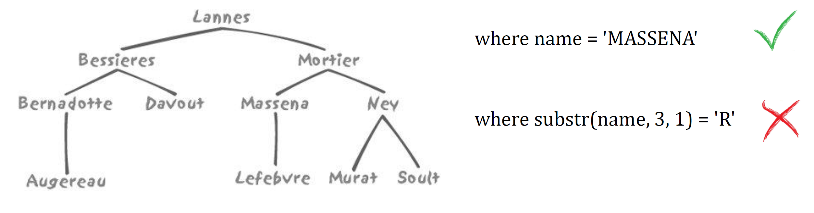

1. B树索引只能进行前缀查询

```sql
where date_entered = to_date('18-JUN-1815', 'DD-M0N-YYYY')
where trunc(date_entered) = to_date('18-JUN-1815','DD-MON-YYYY'])
where date_entered >= to_date(' 18-JUN-1815', 'DD-MON-YYYY') and date_entered < to_date('19-JUN-1815', 'DD-MON-YYYY')
```

### 2.7.3. 索引与外键
1. 系统地对表的外键加上索引|的做法非常普遍
   1. 但是为什么呢?
   2. 有例外吗?
2. 建立索引必须有理由：无论是对外键，或是其他字段都是如此

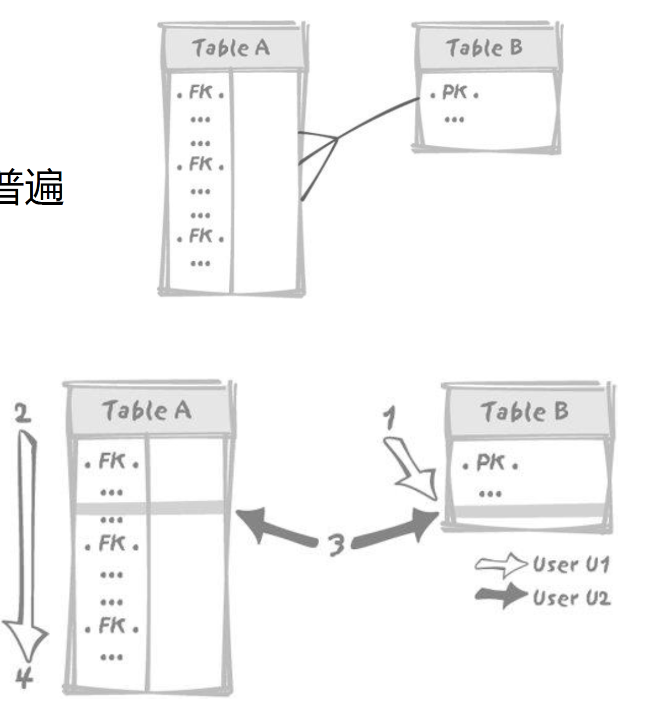

### 2.7.4. 同一字段，多个索引
1. 如果系统为外键自动增加索引，常常会导致同一字段属于多个索引的情况

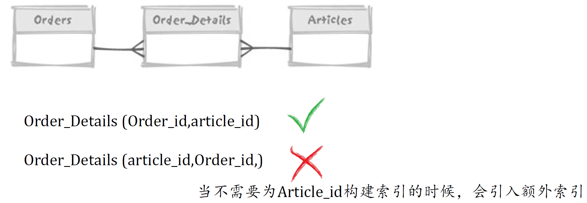

2. 为每个外键建立索引，可能会导致多余索引

### 2.7.5. 系统生成键
1. 系统生产序列号，远好于
   1. 寻找当前最大值并加1
   2. 用一个专用表保存"下一个值"且加锁更新
2. 但如果插入并发性过高，在主键索引的创建操作上会发生十分严重的资源竞争
3. 解决方案
   1. 反向键索引或叫逆向索引(reverse index)
   2. 哈希索引(hash indexing)：高并发自增我们修改为高并发的随机生成

### 2.7.6. 为什么没有使用我的索引?
1. 情况1:我们在使用B+树索引，而且谓词中没有使用索引的最前列：`T，T(X,Y)`上有索引，做`SELECT * FROM T WHERE Y=5`
2. 跳跃式索引(仅CBO)
3. 情况2:使用`SELECT COUNT(*) FROM T`，而且T上有索引，但是优化器仍然全表扫描
4. 情况3:对于一个有索引的列作出函数查询:`Select * from t where f(indexed_col) = value`
5. 情况4:隐形函数查询：隐形的过程导致没有使用索引
6. 情况5:此时如果用了索引，实际反而会更慢
7. 情况6:没有正确的统计信息，造成CBO无法做出正确的选择
8. 总结:归根到底，不使用索引的通常愿意就是"不能使用索引，使用索引会返回不正确的结果"，或者"不该使用索引，如果使用了索引就会变得更慢"

### 2.7.7. 总结:索引访问的不同特点
1. "查询使用了索引就万事大吉"- 误解啊 ~~
2. 索引只是访问数据的一种方式
3. "通过索引定位记录"只是查询工作的一部分
4. 优化器有更多的选择权利
5. 总结:索引不是万灵药。充分理解要处理的数据，做出合理的判断，才能获得高效方案

## 2.8. 思考题
1. 请研究你手上使用的数据库，比如，MySQL or Oracle, 请研究数据库管理系统提供的其它索引形式，并阅读相关的文档
