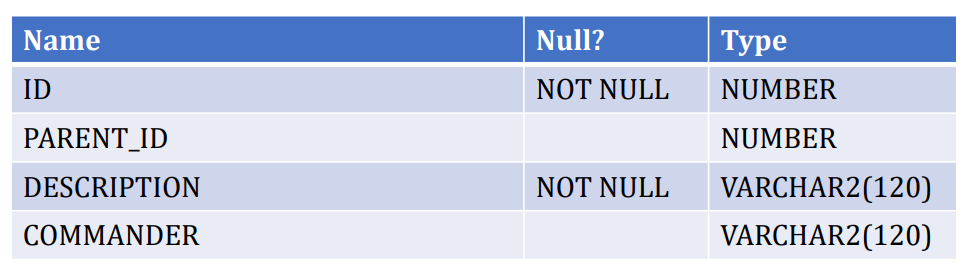
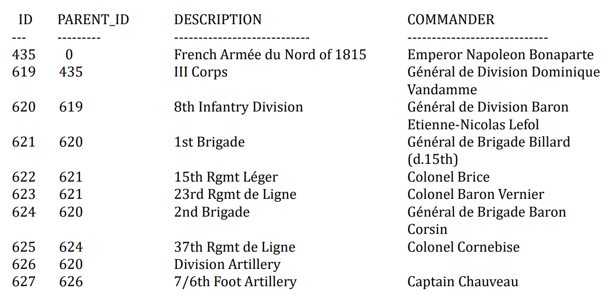
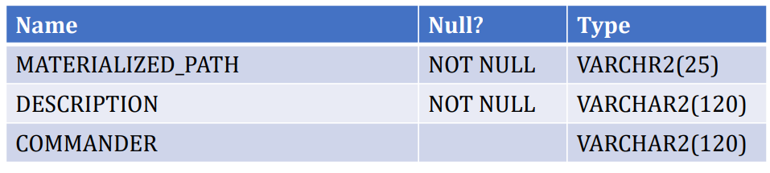
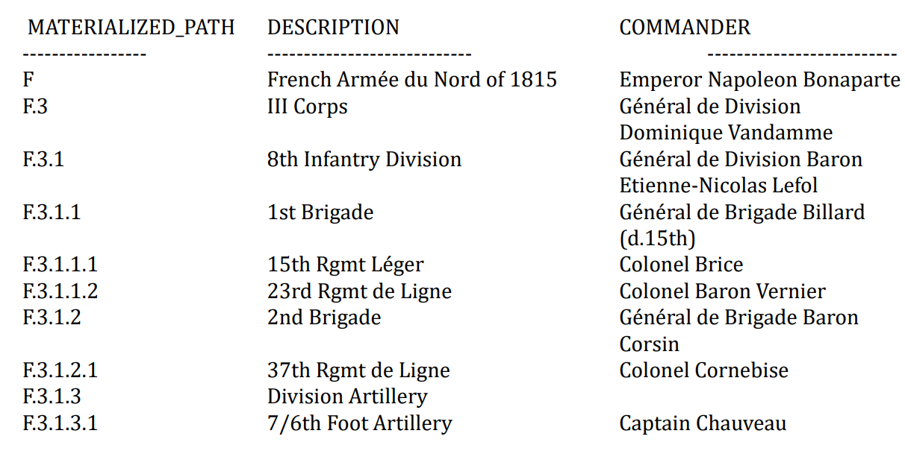
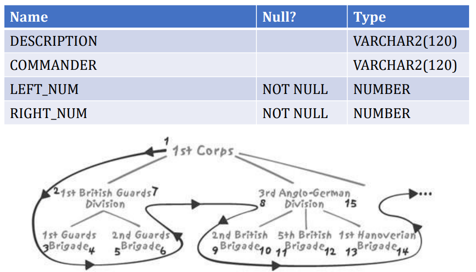
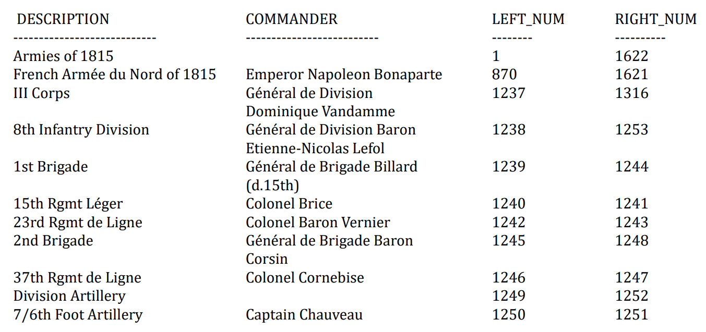

Lec6-数据库模式设计之层次结构
---

# 1. 处理层次结构（Hierarchical Data）
1. 树状结构（Tree Structures）
   1. 历史
      1. 层次数据库
      2. 网状数据库
      3. 关系型数据库
   2. 直到关系理论出现，数据库设计是"科学（science）"而非"工艺（craft）"
      1. 层次性数据广泛存在（XML，LDAP，BOM…）
   3. 层次结构复杂度在于
      1. 访问树的方式

# 2. 树状结构VS.主从结构
1. 父子结构（parent/child link）--tree structure
2. 主从结构（master/detail relationship）
3. 差异
   1. 树状结构保存只需要一张表
   2. 深度
   3. 所有权
   4. 多重父节点
4. 参考书籍：Fabian Pascal：Practical Issues in Database Management（Addion Wesley）

# 3. 层次结构的实际案例
1. Risk exposure
2. 档案位置
3. 原料使用
4. ……
5. 不同的案例具有不同的基本特征
6. 通常，树中的节点数量偏小。实际上，这也是树的优点，便于高效检索

```sql
select building.name building,
  floor.name floor,
  room.name room,
  alley.name alley,
  cabinet.name cabinet,
  shelf.name shelf,
  box.name box,
  folder.name folder
from inventory,
  location folder,
  location box,
  location shelf,
  location cabinet,
  location alley,
  location room,
  location floor,
  location building
where inventory.id = 'AZE087564609'
  and inventory.folder = folder.id
  and folder.located_in = box.id
  and box.located_in = shelf.id
  and shelf.located_in = cabinet.id
  and cabinet.located_in = alley.id
  and alley.located_in = room.id
  and room.located_in = floor.id
  and floor.located_in = building.id
```

# 4. 用SQL数据库描述树结构
1. 只要对象的类型相同，而对象的层树可变，其关系就应该被建模为树结构
2. 在数据库设计中，树通常三种模型
   1. Adjacency model-邻接模型
   2. Materialized path model-物化路径模型
   3. Nested set model-嵌套集合模型
      1. Joe Celko发明
      2. Vadim Tropashko 提出过nested interval model
3. 数据来源http://www.kessler-web.co.uk

# 5. 树的实际实现

## 5.1. 邻接模型
1. ADJACENCY_MODEL



2. 表的每一行描述一个部队，parent_id指向树中的上级部队



## 5.2. 物化路径模型
1. MATERIALIZED_PATH_MODEL



2. 表中有两个索引，在materialized_path上的唯一性索引以及在commander上的索引，正确的设计应该增加id字段。



## 5.3. 嵌套集合模型
1. NESTED_SETS_MODEL




