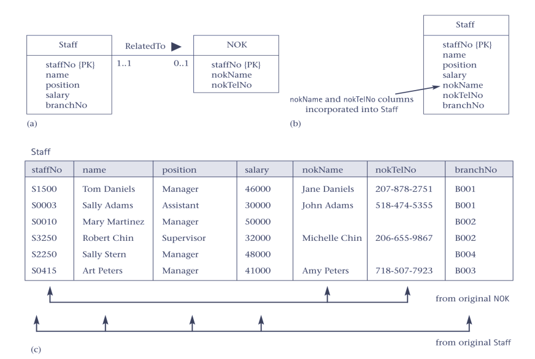
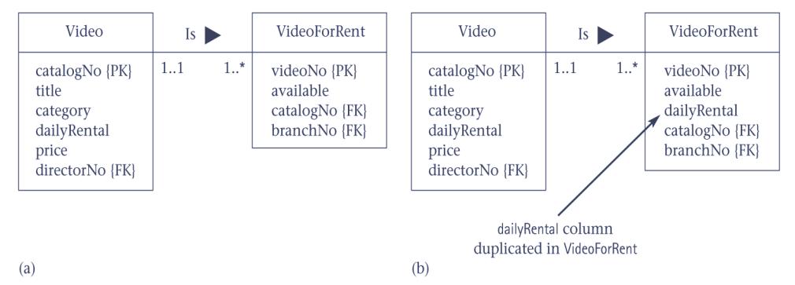
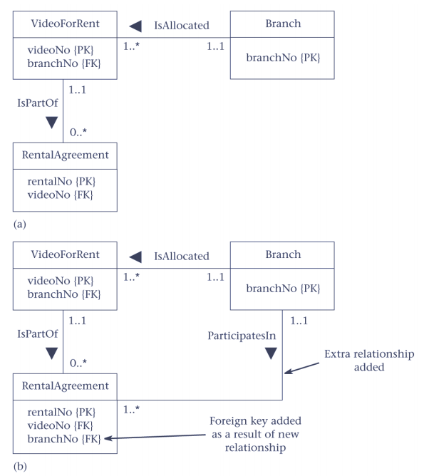
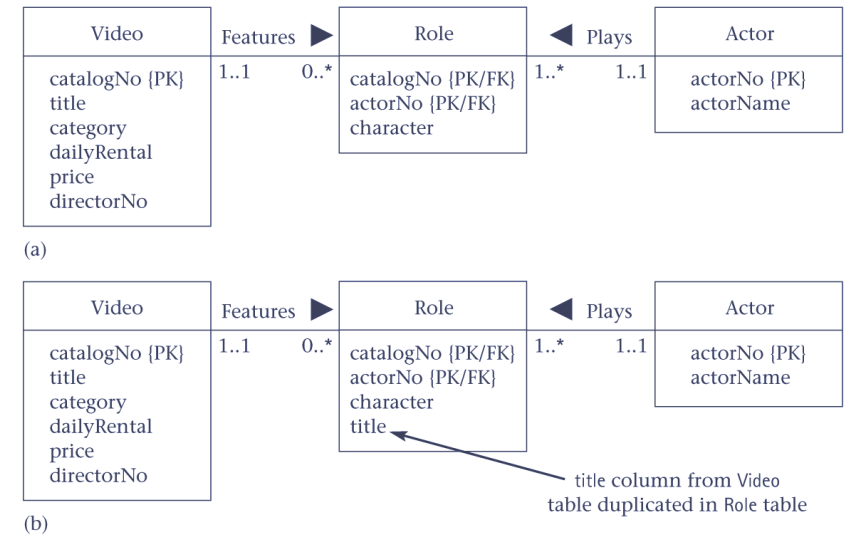

Lec7-对冗余的控制(反范式模式)
---

# 1. Consider the Introduction of Controlled Redundancy
1. Determine whether introducing redundancy in a controlled manner by relaxing the normalization rules will improve system performance.

# 2. Denormalization
1. Refinement to relational schema such that the degree of normalization for a modified table is less than the degree of at least one of the original tables.
2. Also use term more loosely to refer to situations where two tables are combined into one new table, which is still normalized but contains more nulls than original tables.

# 3. Consider the Introduction of Controlled Redundancy
1. Consider denormalization in following situations, specifically to speed up frequent or critical transactions:
   1. Pattern 1 Combining 1:1 relationships
   2. Pattern 2 Duplicating nonkey columns in 1:* relationships to reduce joins
   3. Pattern 3 Duplicating FK columns in 1:* relationships to reduce joins
   4. Pattern 4 Duplicating columns in *:* relationships to reduce joins
   5. Pattern 5 Introducing repeating groups
   6. Pattern 6 Creating extract tables
   7. Pattern 7 Partitioning tables.

## 3.1. Pattern 1 Combining 1:1 relationships

## 3.2. Pattern 2 Duplicating nonkey columns in 1:* relationships to reduce joins

## 3.3. Pattern 3 Duplicating FK columns in 1:* relationship to reduce joins

## 3.4. Pattern 4 Duplicating columns in *:* relationships to reduce joins

## 3.5. Pattern 5 Introducing repeating groups

## 3.6. Pattern 6 Creating extract tables
1. Reports can access derived data and perform multitable joins on same set of base tables. However, data report based on may be relatively static or may not have to be current.
2. Can create a single, highly denormalized extract table based on tables required by reports, and allow users to access extract table directly instead of base tables.

## 3.7. Pattern 7 Partitioning tables
1. Rather than combining tables, could decompose a table into a smaller number of partitions.
2. Horizontal partition: distribute records across a number of (smaller) tables.
3. Vertical partition: distribute columns across a number of (smaller) tables. PK duplicated to allow reconstruction.
4. Partitions useful for applications that store and analyze large amounts of data.