Lec8-并发处理
---

# 1. 处理并发和大数据量

## 1.1. 索引的优点
1. 一个有三个字段的表，前两个字段为整数（1-50000）第一个字段是PK，第二个字段没有索引。第三个名为label字段是字符型，长度30-50的随机字符串

```sql
/* 5000次/s */
select label
  from test_table
    where indexed_column = random value
/* 25次/s */
select label
  from test_table
    where unindexed_column = random value
```

2. 响应时间不到一秒，仍然可能隐藏着重大的性能问题，不要相信单独某次测试。

## 1.2. 索引的优点
1. 低频率查询（500次/分钟）

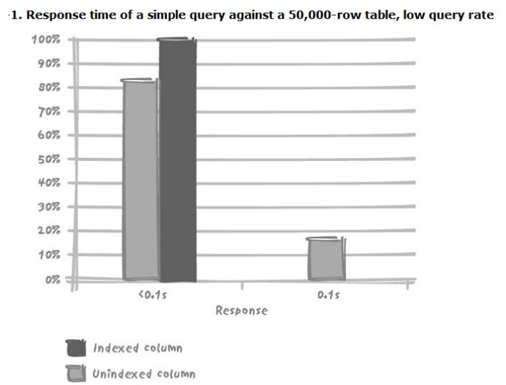

2. 高频率查询（5000次/分钟）

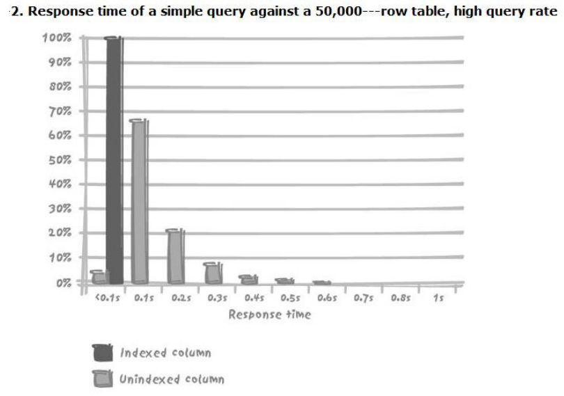

3. 超高频率查询（10000次/分钟）:负载增加未必是造成性能问题的原因，它只不过使性能问题暴露出来了而已

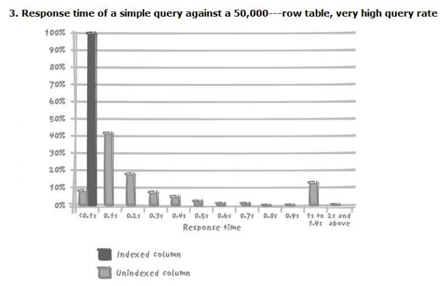

## 1.3. 排队
1. 数据库引擎是否能快速服务
   1. 数据库引擎性能（引擎、硬件、I/0系统效率…）
   2. 数据服务的请求复杂度

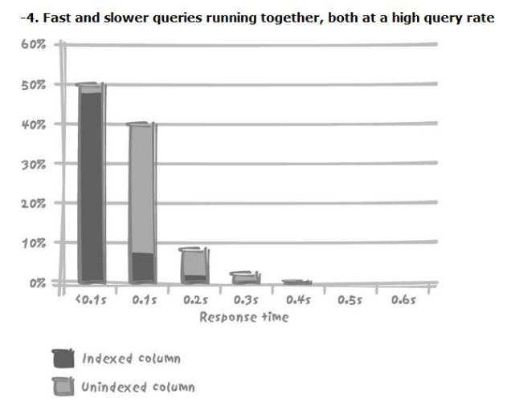

# 2. 并发修改数据

## 2.1. 加锁
1. 锁的粒度
   1. 整个数据库、存储被修改的表的那部分物理单元、要修改的表、包含目标数据的的块和页、包含受影响数据的记录、记录中的字段
   2. 只有使用了索引才能使用到行锁

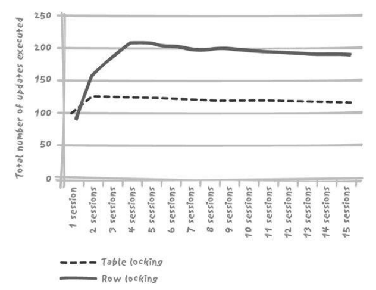

## 2.2. 加锁处理
1. 不要随便使用表级锁
2. 尽量缩短加锁时间
   1. Delete没有where，用truncate
3. 索引也需要维护
4. 语句性能高，未必程序性能高
   1. 尽可能避免SQL语句上的循环处理
   2. 尽量减少程序和数据库之间的交互次数
   3. 充分利用DBMS提供的机制，使跨机器交互的次数降至最少
   4. 把所有不重要不必须的SQL语句放在逻辑工作单元之外

## 2.3. 加锁与提交
1. 想要使加锁时间最短，必须频繁的提交
2. 但如果每个逻辑单元完成后都提交会增加大量开销
3. 数据库最大的开销是日志的记录(频繁的提交)，是否需要进行缓存之后大规模数据提交

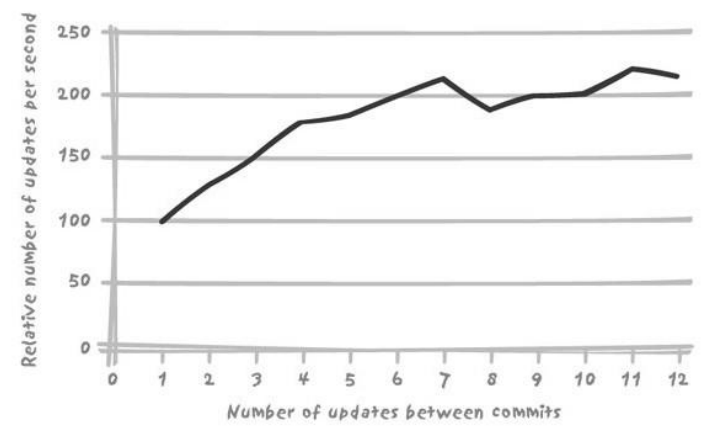

## 2.4. 加锁与可伸缩性
1. 与表级锁相比，行级锁能产生更佳的吞吐量
2. 行级锁大都性能曲线很快达到极限
3. 但是不同的数据库产品不太一样

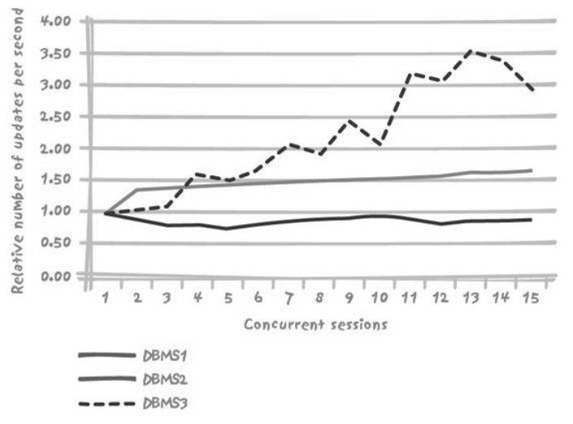

## 2.5. 资源竞争

1. 插入与竞争
   1. Table 是有14个字段、两个唯一性索引的表
   2. 主键为系统产生的编号，而真正的键是由短字符串和日期值组成的复合键，必须满足唯一性约束
   3. 使用随机数字段代替自增字段，避免出现问题55

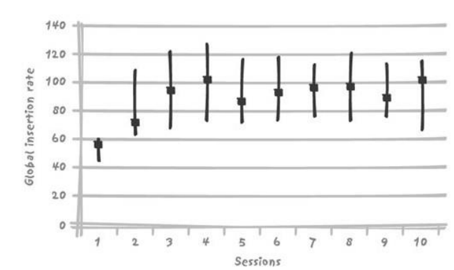

2. DBA解决方案
   1. 事务空间（Transaction space）
   2. 可用列表（Free list）
3. 架构解决方案
   1. 分区（Partitioning）
   2. 逆序索引（Reverse index）
   3. 索引组织表（Index organized table）
4. 开发解决方案
   1. 调节并发数
   2. 不使用系统产生值
5. 限制insert操作之间竞争的技术

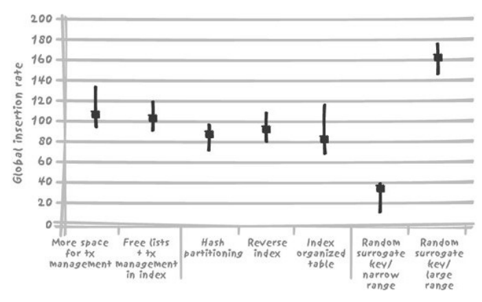

6. Session数较少时竞争限制技术的表现

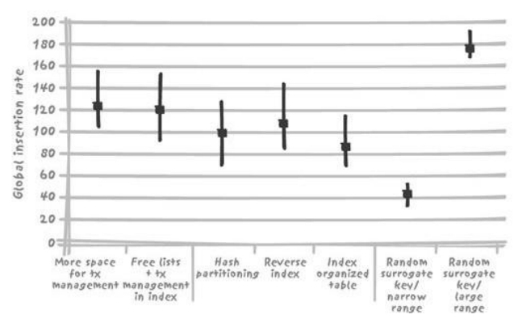

7. 上述案例的瓶颈是主键索引
8. Session的差异说明，有些技术需要已处于饱和状态的CPU提供资源，所以不能带来性能上的改善
9. 上述案例避免竞争的方法是避免使用顺序产生的代理键……
10. 总结：与加锁不同，数据库竞争是可以改善的。架构师、开发者和DBA都可以从各自的角度改善竞争。

# 3. 应付大数据量

## 3.1. 增长的数据量
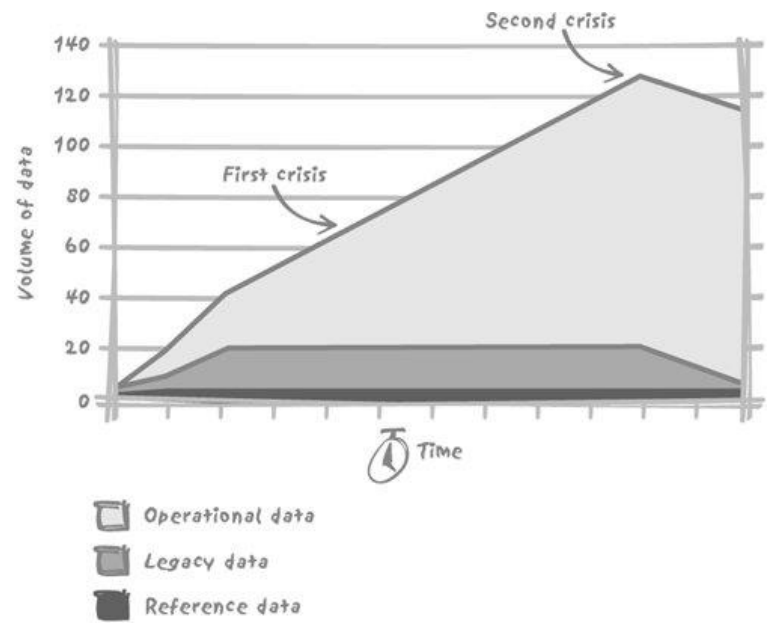

## 3.2. 操作对数据量增加的敏感程度
1. 受数据量的增加，影响不大
2. 受数据量的增加，线性影响
3. 受数据量的增加，非线性影响

### 3.2.1. 影响不大
1. 主键检索等值单一查询

```sql
SQL> declare
    2 n_id number;
    3 cursor c is select customer_id
    4 from orders
    5 where order_id between 10000 and 20000;
    6 begin
    7 open c;
    8 loop
    9 fetch c into n_id;
    10 exit when c%notfound;
    11 end loop;
    12 close c;
    13 end;
    14 /
PL/SQL procedure successfully completed.
Elapsed: 00:00:00.27

SQL> declare
    2 n_id number;
    3 begin
    4 for i in 10000 .. 20000
    5 loop
    6 select customer_id
    7 into n_id
    8 from orders
    9 where order_id = i;
    10 end loop;
    11 end;
    12 /
PL/SQL procedure successfully completed.
Elapsed: 00:00:00.63
```

### 3.2.2. 线性影响
1. 返回记录数量和查询毫无关系
2. SQL操作的数据和最后返回的结果无关（聚合函数）
3. 可选的唯一方法：引入其他条件（例如时间范围）
   1. 设定上限
   2. 不是单纯的技术问题
   3. 还依赖于业务需求

### 3.2.3. 非线性影响
1. 排序性能影响非线性
2. 排序性能减低间歇性
   1. 因为较小型的排序全部在内存中执行，而较大型的排序（涉及多个有序子集的合并）则需要将有序子集临时存储到硬盘中。所以通过调整分配给排序的内存数量来改善排序密集型操作的性能是常见且有效地调优技巧。

```
ORDERS
order_id        bigint(20) (primary key)
customer_id     bigint(20)
order_date      datetime
order_shipping  char(1)
order_comment   varchar(50)
```

1. primary key-based search:

```sql
select order_date
from orders
where order_id = ?
```

2. sort:

```sql
select customer_id
from orders
order by order_date
```

3. grouping:

```sql
select customer_id, count(*)
from orders
group by customer_id
having count(*) > 3
```

4. maximum value in a nonindexed column:

```sql
select max(order_date)
from orders
```

5. "top 5" customers by number of orders:

```sql
select customer_id
from (select customer_id, count(*)
      from orders
      group by customer_id
      order by 2 desc) as sorted_customers
limit 5
```

6. 记录数大概从8000-1000000之间，不同的cid大概3000个

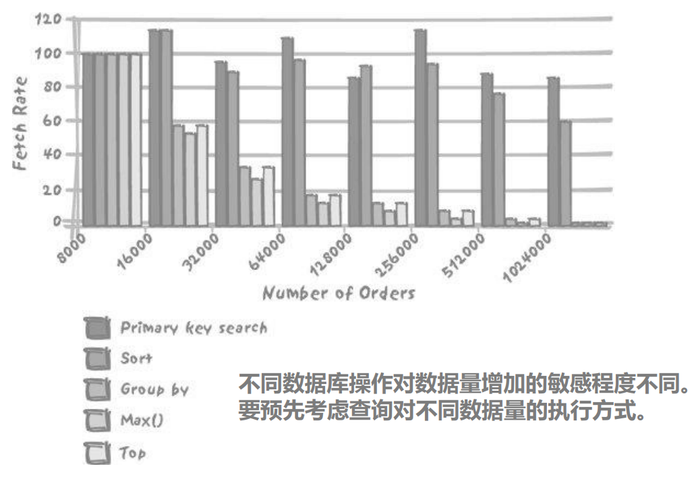

# 4. 大数据的处理逻辑

## 4.1. 综合的考量
1. 数据量增加对性能的预估
   1. 隐藏在查询背后对数据量的高敏感性
   2. 比如max（）对高数据量的敏感，而直接引起子查询性能缓慢降低，必须使用非关联子查询。
2. 排序的影响
   1. 字节数量而不是记录数量
   2. 也就是被排序的总数据量
   3. Join应该延后到查询的最后阶段
3. Join延迟到查询的最后阶段
   1. 例子：查询一年内的10大客户的名称和地址
   2. 目标，对尽量少的数据进行排序

```sql
select *
  from (select  c.customer_name,
                c.customer_address,
                c.customer_postal_code,
                c.customer_state,
                c.customer_country
                sum(d.amount)
    from customers c,
          orders_o,
          order_detail d
    where c.customer_id = o.customer_id
      and o.order_date >= some date expression
      and o.order_id = d.order_id
    group by  c.customer_name,
              c.customer_address,
              c.customer_postal_code,
              c.customer_state,
              c.customer_country
    order by 6 desc) as A
  limit 10


select  c.customer_name,
        c.customer_address,
        c.customer_postal_code,
        c.customer_state,
        c.customer_country
        b.amount
    from (select  a.customer_id,
                  a.amount
      from (select o.customer_id,
                  sum(d.amount) as amount
        from  orders_o,
              order_detail d
        where o.order_date >= some date expression
          and o.order_id = d.order_id
        group by o.customer_id
        order by 2 desc) as a
      limit 10) as b,
      customers c
  where c.customer_id = b.customer_id
  order by b.amount desc
```

## 4.2. 消除关联子查询
1. 例子：每小时以批处理的形式更新安全管理表

```sql
insert /*+ append */ into fast_scrty
  ( emplid,
    rowsecclass,
    access_cd,
    empl_rcd,
    name,
    last_name_srch,
    setid_dept,
    deptid,
    name_ac,
    per_status,
    scrty_ovrd_type)
  select distinct
    emplid,
    rowsecclass,
    access_cd,
    empl_rcd,
    name,
    last_name_srch,
    setid_dept,
    deptid,
    name_ac,
    per_status,
    'N'
  from pers_search_fast
```

```sql
1     select  a.emplid,
2             sec.rowsecclass,
3             sec.access_cd,
4             job.empl_rcd,
5             b.name,
6             b.last_name_srch,
7             job.setid_dept,
8             job.deptid,
9             b.name_ac,
10            a.per_status
11    from  person a,
12          person_name b,
13          job,
14          scrty_tbl_dept sec
15    where a.emplid = b.emplid
16        and b.emplid = job.emplid
17        and (job.effdt=
18          ( select max(job2.effdt)
19            from job job2
20            where job.emplid = job2.emplid
21              and job.empl-rcd = job2.empl_rcd
22              and job2.effdt <=
23                to_date(to_char(sysdate,
24                  'YYYY-MM-DD'),'YYYY-MM-DD'))
25        and job.effseq =
26            ( select max(job3.effseq)
27              from job job3
28              where job.emplid = job3.emplid
29                and job.empl_rcd = job3.empl_rcd
30                and job.effdt = job3.effdt ) )
31    and sec.access_cd = 'Y'
32    and exists
33        ( select 'X'
34          from treenode tn
35          where tn.setid = sec.setid
36            and tn.setid = job.setid_dept
37            and tn.tree_name = 'DEPT_SECURITY'
38            and tn.effdt = sec.tree_effdt
39            and tn.tree_node = job.deptid
40            and tn.tree_node_num  between sec.tree_node_num
41                                      and sec.tree_node_num_end
42            and not exists
43              ( select 'X'
44                from scrty_tbl_dept sec2
45                where sec.rowsecclass = sec2.rowsecclass
46                  and sec.setid = sec2.setid
47                  and sec.tree_node_num <> sec2.tree_node_num
48                  and tn.tree_node_num
49                      between sec2.tree_node_num
50                      and sec2.tree_node_num_end
51                  and sec2.tree_node_num
52                      between sec.tree_node_num
53                      and sec.tree_node_num_end ))
```

## 4.3. 通过分区提高性能
1. 记住，单边范围条件不能充分利用索引和分区
2. 所有的更新操作中，删除（delete）最优可能造成麻烦
3. 当数据量大到一定程度，不得不进入“读写分离”的数据仓库领域